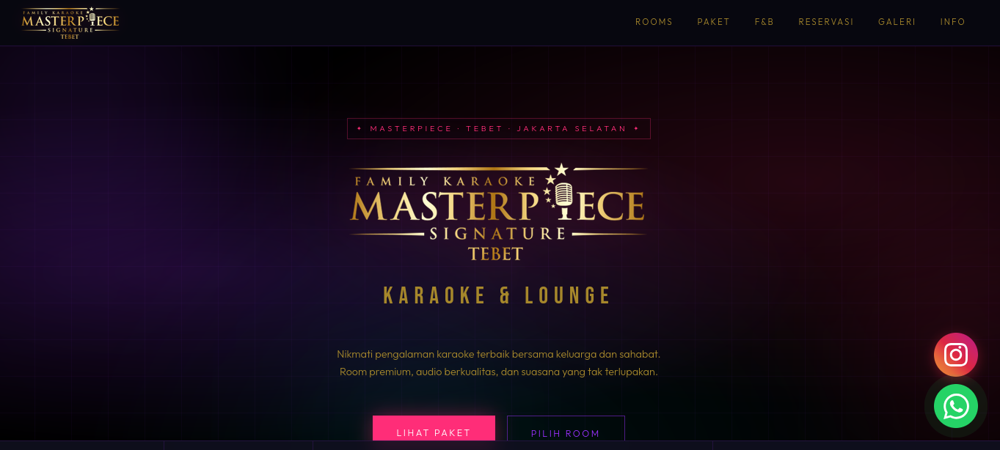
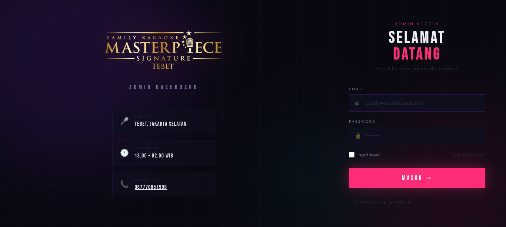
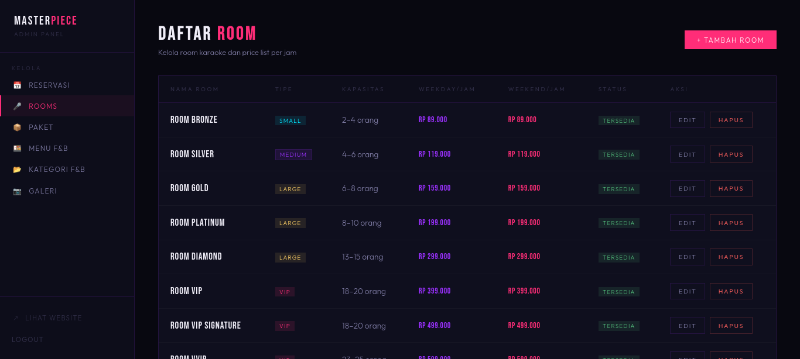

# 🎤 Masterpiece Signature Karaoke — Tebet

### Laravel 12 · Neon Dark Theme

---

## 📸 Screenshots

### 🏠 Homepage Publik


(public/screenshots/homepage2.png)
(public/screenshots/homepage3.png)
(public/screenshots/homepage4.png)
(public/screenshots/homepage5.png)
(public/screenshots/homepage6.png)
(public/screenshots/homepage7.png)
(public/screenshots/homepage8.png)

### 🔑 Halaman Login



### 🔑 Halaman Dashboard Admin



---

## 🗂️ Struktur Fitur

| Modul     | Publik                          | Admin                   |
| --------- | ------------------------------- | ----------------------- |
| **Rooms** | Price list weekday/weekend      | CRUD room + kapasitas   |
| **Paket** | Kartu paket dengan isi bundling | CRUD paket + includes   |
| **F&B**   | Tab per kategori + price list   | CRUD item & kategori    |
| **Info**  | Jam buka, lokasi, ketentuan     | (static, edit di blade) |

---

## 🚀 Instalasi

### 1. Buat project Laravel 12

```bash
composer create-project laravel/laravel masterpiece-karaoke
cd masterpiece-karaoke
```

### 2. Install Laravel Breeze (auth)

```bash
composer require laravel/breeze --dev
php artisan breeze:install blade
```

### 3. Copy semua file dari ZIP ini ke dalam project

Salin seluruh isi folder ke direktori Laravel Anda.

### 4. Konfigurasi .env

```env
APP_NAME="Masterpiece Signature Karaoke"
APP_URL=http://localhost:8000

DB_CONNECTION=mysql
DB_HOST=127.0.0.1
DB_PORT=3306
DB_DATABASE=masterpiece_karaoke
DB_USERNAME=root
DB_PASSWORD=your_password
```

### 5. Buat database

```sql
CREATE DATABASE masterpiece_karaoke CHARACTER SET utf8mb4 COLLATE utf8mb4_unicode_ci;
```

### 6. Migrate & Seed

```bash
php artisan migrate
php artisan db:seed
php artisan storage:link
php artisan serve
```

---

## 🔑 Login Admin

|          |                         |
| -------- | ----------------------- |
| Email    | `admin@masterpiece.com` |
| Password | `password`              |

---

## 🌐 URL

| Halaman            | URL                                          |
| ------------------ | -------------------------------------------- |
| Homepage publik    | `http://localhost:8000`                      |
| Login admin        | `http://localhost:8000/login`                |
| Admin rooms        | `http://localhost:8000/admin/rooms`          |
| Admin paket        | `http://localhost:8000/admin/packages`       |
| Admin F&B          | `http://localhost:8000/admin/fnb/items`      |
| Admin kategori F&B | `http://localhost:8000/admin/fnb/categories` |

---

## 📋 Data Seeder (Siap Pakai)

**4 Room:**

- Room Cozy (Small) — 2–4 orang
- Room Classic (Medium) — 4–8 orang
- Room Grand (Large) — 8–15 orang
- Room VIP Sakura (VIP) — 4–10 orang

**4 Paket:**

- Paket Hemat, Paket Asik (Best Seller), Paket Family, Paket VIP All-In

**4 Kategori F&B + 21 item:**

- Minuman, Makanan Berat, Snack & Cemilan, Dessert

---

## ✏️ Kustomisasi

- **Nomor WhatsApp:** Cari `62xxxxxxxxxxx` di `home.blade.php` dan ganti dengan nomor asli
- **Alamat & jam buka:** Edit langsung di `home.blade.php` section `#info`
- **Nama brand:** Ganti `MASTERPIECE` di `layouts/app.blade.php`
